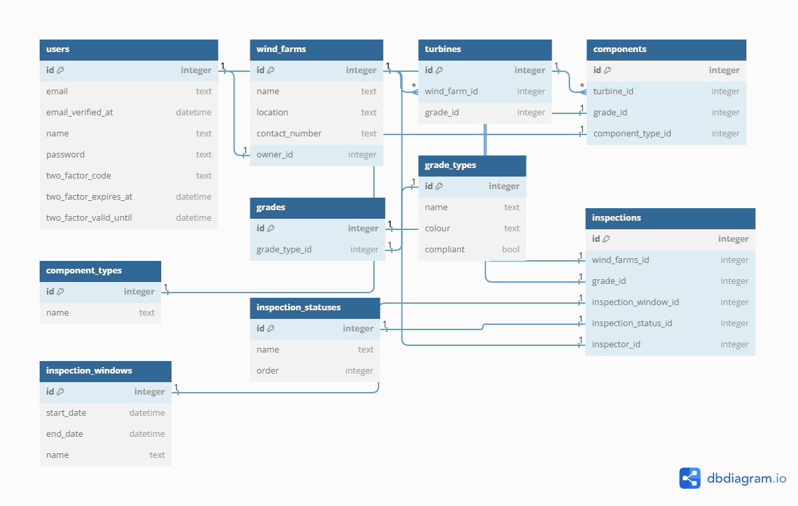

## About Software Development @ Cyberhawk


## The task
We've designed this task to try and give you the ability to show us what you can do and hopefully flex your technical and creative muscles. You can't show off too much here, show us you at your best and wow us!

To make things as simple as we could, we've opted to use [Laravel Sail](https://laravel.com/docs/8.x/sail) to provide a quick and convenient development environment, this will require you to install
[Docker Desktop](https://www.docker.com/products/docker-desktop) before you can start the test. We've provided [some more detailed instructions](#setting-everything-up) below in case this is your first time using Docker or Sail.

We'd like you to build an application that will display an example wind farm, its turbines and their components.
We'd like to be able to see components and their grades (measurement of damage/wear) ranging between 1 - 5.

For example, a turbine could contain the following components:
- Blade
- Rotor
- Hub
- Generator

Don't worry about using real names for components or accurate looking data, we're more interested in how you structure the application and how you present the data.

Don't be afraid of submitting incomplete code or code that isn't quite doing what you would like, just like your maths teacher, we like to see your working.
Just Document what you had hoped to achieve and your thoughts behind any unfinished code, so that we know what your plan was.

### Requirements
- Each Turbine should have a number of components
- A component can be given a grade from 1 to 5 (1 being perfect and 5 being completely broken/missing)
- Use Laravel Models to represent the Entities in the task.
- Conform to the spec provided in the `api-spec.yaml` file in the root of this project.
    - If your API matches the spec the provided pre-built front-end should be able to display the data provided via your API

### Bonus Points
- Automated tests
- API Authentication
- API Authorization
- Use of coding style guidelines (we use PSR-12 and AirBnb)
- Use of git with clear logical commits
- Specs/Plans/Designs

### Submitting The Task
Ideally you will fork this repo, work on it then email us with details of where to access it.
Alternatively you can download locally and email us a zip of your completed work.

## Setting Everything Up
As mentioned above we have chosen to make use of Laravel Sail as the foundation of this technical test.
- If you haven't already, you will need to install [Docker Desktop](https://www.docker.com/products/docker-desktop).
- One that is installed your next step is to install this projects composer dependencies (including Sail).
    - This will require either PHP 8 installed on your local machine or the use of [a small docker container](https://laravel.com/docs/8.x/sail#installing-composer-dependencies-for-existing-projects) that runs PHP 8 that can install the dependencies for us.
- If you haven't done so already copy the `.env.example` file to `.env`
    - If you are running a local development environment you may need to change some default ports in the `.env` file
        - We've already changed mysql to 33060 and NGINX to 81 for you
- It should now be time to [start Sail](https://laravel.com/docs/8.x/sail#starting-and-stopping-sail) and the task
- There is a file in the root of this project called `api-spec.yaml` this can be imported into your application of choice to ensure you're building your application to the spec that we're expecting. Some notable applications are:
  - Postman
  - Swagger
  - StopLight


### Installing Composer Dependencies
https://laravel.com/docs/9.x/sail#installing-composer-dependencies-for-existing-projects
```bash
docker run --rm \
-u "$(id -u):$(id -g)" \
-v $(pwd):/var/www/html \
-w /var/www/html \
laravelsail/php81-composer:latest \
composer install --ignore-platform-reqs
```

### Quick Tips
- Don't run npm/composer from your host, always run it via the sail command
  - This is because the docker container may not be able to write to the filesystem after you do so
- Ensure you have a valid .env file before starting sail for the first time.
  - Sail creates a docker volume which is persistent, so stopping/starting sail will not affect/fix issues in a volume (missing DB etc)

## Your Notes

Idea is to create a small-scale inspection system linked to periods of time when wind farms can be inspected.
During each period or window, an inspection can be started, and each component of each turbine within the wind farm is inspected.
This then gives the turbine a collective grade, and in turn, gives the wind farm an overall grade for that inspection window.
Will also link to whether or not the wind farm has passed or failed compliance.
Finally, user will be able to filter through previous inspections to see which wind farms passed, failed, what grade they were assigned etc.

First step is to plan out a Database Schema that will help with scoping what features are needed to build this solution.



Here is a rough idea of what the schema will look like, although this is subject to change.

Next I create my Models and Migrations to update the database with the tables I need.
I use the `sail artisan make:model <ModelName> --all` command to do this.
This will create the following files; Model, Migration, Form Request, Policy, Controller, Factory, Seeder
This allows me to fully utilize Laravel as MVC framework, and I can always delete any classes that I don't need later.
I then populate these files with the correct fields and relationships that are required.

At this point, I am considering creating some tests that mirror my models, to match the fields to the api spec.
I create a Unit test using the `sail artisan make:test <ModelName>Test --unit`, and populate with some general tests.
I also want to be using Model Factories and Seeders to achieve the task, so that I can quickly populate my app with
data to be used and tested against. After filling out some adequate tests, I make sure my factories represent the
correct fields to match my models, and then go on to fill out the seeder classes, so that my models can be generated.

At this point, I can run `sail artisan db:wipe` and then `sail artisan migrate:fresh --seed` to generate a full
dataset that meets the requirements of the api spec. I also added in a field for the score of the grade types; even
though this is not required by the spec, it is required for the task.

